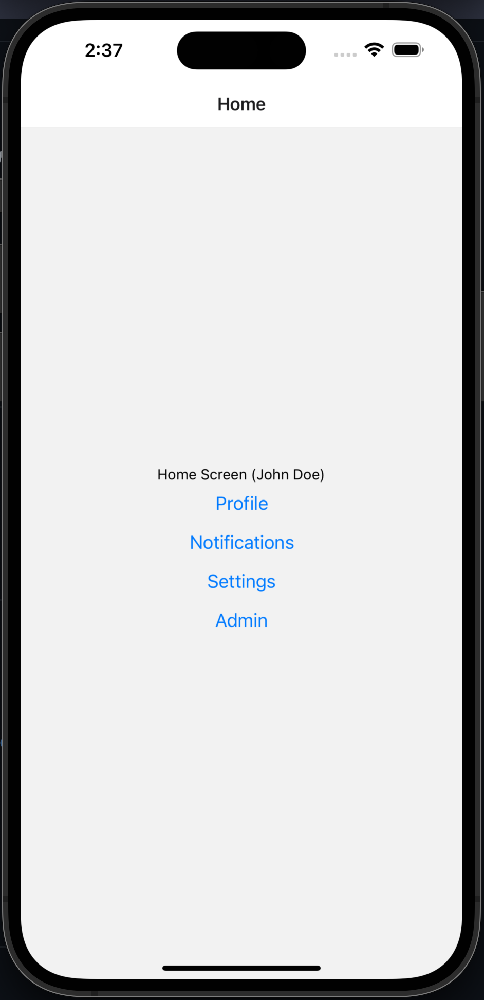

# WebNative

✨ Mono Repo Powered by Nx.

## React Native (Expo)

### What is it?

`apps/mobile` is a `React-Native` application with:

- 5 Screens
- Mobile Navigation
- App-Level Context
- App-level tiny store (Redux)
- Shared libs called `wrapsody`, (native /web)

### How to try it out?

Steps to take this repo for a spin:

- Clone repo (git clone <this-repo-name>)
- yarn install
- yarn start

Note: Refer to Nx documentation if you encounter any errors (depends on your computer setup)

## Understand repo dependency

To see a diagram of the dependencies of the projects simply run:

- `yarn nx graph`

## Further help

`### Mono Repo (Nx)`

Visit the [Nx Documentation](https://nx.dev) to learn more.

`### This Repo`

Contact the author via email.

 
 

 
